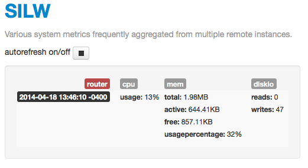

# SILW
This is a simple utility that allows one user to monitor several remote systems, provided he has the proper credentials and the authorization to execute remote commands. Inspired from [usagewatch](https://github.com/nethacker/usagewatch), SILW differs by targeting remote systems and exposing a simple and customizable Sinatra web app.

### SILW Plugins available in this release

  - **Meminfo** - report the memory stats collected from a remote system.
  - **CPU info** - report the total CPU usage for a remote system.
  - **Diskio** - report the disk usage on a remote system.

In order to use SILW, you must be authorized to use the target systems, and make sure you can authenticate and that you are authorized to run various system commands i.e. `top`, `free`, read the content of the `/proc/meminfo` file.

### Using the gem in command line mode
First create a `silw.yaml` config file in your home directory. Excerpt from `~/silw.yaml`:

    :monitoring:
      router:
        :freq: 10s
        :plugins: cpu mem diskio

    :authentication:
      :username: username_with_remote_access
      :password: ~/.ssh/id_dsa (or password!!)

    :server: 
      :port: 8080

and use SILW for querying the remote servers defined under the `:monitoring:`:

    silw exec cpu
    silw exec mem cpu diskio

Or specify a different remote server, for example:

    silw exec cpu mem -s router

    {"host":"router","cpu":{"cpu_usage":"12.5%"}}
    {"host":"router","mem":{"total":2075624.0,"active":538692.0,"free":1135688.0,"usagepercentage":26}}

Without a configuration file, you'll have to specify the remote server and a valid username and password combination, for example:

    silw exec cpu -s honeypot -u florin -k ~/.ssh/xtraterrestrial_dsa

### Using the gem as a local web service
You can use SILW to monitor remote systems from your browser. For this you will have to create or modify the SILW configuration file: `silw.yaml`. Example:
    
    :monitoring:
      triba:
        :freq: 1min
        :plugins: mem, diskio, cpu
      zorius:
        :freq: 30s
        :plugins: cpu, diskio
    authentication:
      :username: johndoe
      :password: ~/.ssh/id_dsa
    :server: 
      :port: 8080

Say the config file above is called: `silw.yaml` and it is created in your home folder. Then start the SILW server like this:

    silw server start -c ~/silw.yaml

View the data collected in your web browser by pointing it to `http://0.0.0.0:8080`, if the `server.port` in the config file was `8080`. You will see a similar interface:

Run: `silw server stop`, to stop the server.

### Integration with [Logstash](http://logstash.net/)
Because you are using a centralized logging system for collecting your metrics :) SILW can be configured to echo the stats collected to [Logstash](http://logstash.net/).

		# Echo the stats directly to logstash
		:logstash:
		  :host: localhost
			:port: 5228, udp
			# or:
			# :port: 5229, tcp

Excerpt from a SILW-logstash output:

			{
             "message" => "{\"@tags\":[],\"@fields\":{\"host\":\"honeypot\",\"diskio\":[0,24]},
               \"@timestamp\":\"2014-04-18T13:48:00.663-04:00\",\"@version\":\"1\",\"severity\":\"INFO\"}",
            "@version" => "1",
          "@timestamp" => "2014-04-18T17:48:00.663Z",
                "host" => "127.0.0.1:50719",
                "type" => "silw",
               "@tags" => [],
             "@fields" => {
                "host" => "honeypot",
              "diskio" => [
                  [0] 0,
                  [1] 24
              ]
          },
            "severity" => "INFO"
      }

SILW is using the [logstash-logger](https://github.com/dwbutler/logstash-logger) gem

### Testing

    cd silw
    bundle exec rake

### Contributing

* Fork it
* Create your feature branch (``git checkout -b my-new-feature``)
* Add some tests and please make sure they pass
* Commit your changes (``git commit -am 'Added some feature'``)
* Push to the branch (``git push origin my-new-feature``)
* Create new Pull Request

## License
Copyright (c) 2014 Florin T.Pătraşcu

[MIT License](LICENSE.txt)
